# Railway Accelerometric Signal Analysis and Curve Component Attenuation 

## Introduction 
This work addresses the study of signals and their frequency analysis. Specifically, the project under consideration was carried out in collaboration with IVM SRL, an SME dedicated to the development of monitoring and diagnostic systems, primarily focused on wheel/rail interaction, under both static and dynamic conditions.

Railway maintenance aims to prevent problems that can arise over time, starting with monitoring the characteristic elements of the rail, including welds and joints.
Joints are elements made up of two portions of rail and an insulating material placed between them; they serve to isolate the current in such a way as to warn the passage of the train to prevent collisions. Therefore, if the rails are too close together, a phenomenon that can occur for example due to thermal expansion, problems can arise and therefore monitoring over time is essential.

The aim of the work under consideration is to clean the signal and eliminate the frequencies excited by the curved phenomenon, so as to make the described elements that are intended to be monitored more visible.

The data under consideration are accelerometric signals (2000 samples per second) representing the perpendicular components of the accelerations to the plane of the rail; these are produced by the interaction of the wheel with the rail. We observe that, since the sampling is dense, we have a good approximation of continuous representation of the signal.

The measurements were made using an accelerometer placed on the bushing of a line train wheel. Starting from the accelerometric signals, the frequencies representative of the accelerations during the curve are analyzed and subsequently the signal is appropriately reduced with known filtering techniques.

Below are some photographs taken in the laboratory of the IVM SRL company. The images contain some tools used for data collection.

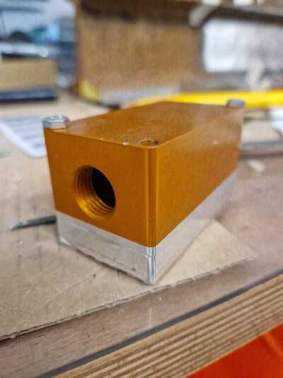
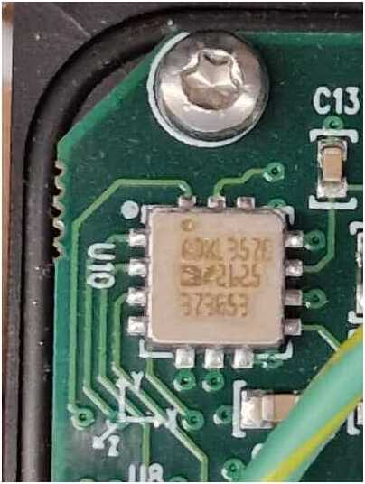

A signal s is described by a time-dependent mathematical function. This function represents the variation of a quantity as a function of time and can be expressed as s=S(t) .

The Fourier transform is a very useful mathematical tool for signal analysis; it allows us to move from studying a phenomenon from the time domain to the frequency domain.

## Fourier Transform

The Fourier transform (FT) is an operation that allows you to obtain the frequency content of a signal, while the inverse Fourier transform allows you to obtain a signal from its frequency content.

Let $f(x)$ be a function defined in the interval $(-\pi,\pi)$; $f(x)$ can be developed in Fourier series if

$$ f(x)=\frac{1}{2}a_0+\sum_{n=1}^{\infty}a_ncos(nx)+b_nsin(nx) $$

where, integrating both sides between $−\pi$ and $\pi$ and taking into account the symmetries of $sin(x)$ and $cos(x)$, we have

$$a_n=\frac{1}{\pi}\int_{-\pi}^{\pi}f(x)cos(nx)dx, \hspace{0.1 cm} b_n=\frac{1}{\pi}\int_{-\pi}^{\pi}f(x)sin(nx)dx.$$

$a_0,a_n$ and $b_n$ called Fourier coefficients.

More generally, if $f(x)$ is defined in the interval $(c−d,c+d)$ then

$$f(x)\sim \frac{a_0}{2}+\sum_{n=1}^{\infty}a_ncos(\frac{n\pi(x+c)}{d}) +b_nsin(\frac{n\pi(x+c)}{d})$$ in cui $$a_n=\frac{1}{d}\int_{c-d}^{c+d}f(x)cos(\frac{n\pi(x+c)}{d})dx, \\  b_n=\frac{1}{d}\int_{c-d}^{c+d}f(x)sin(\frac{n\pi(x+c)}{d})dx.$$

Taking into account the Euler identity ( $eix=cos(x)+i⋅sin(x)$ ) it is possible to rewrite the Fourier series as follows
$$\frac{a_0}{2}+\sum_{n=1}^{\infty}(a_ncos(nx)+b_nsin(nx))=\sum_{n=-\infty}^{+\infty}c_ne^{inx} $$
where
$$c_n =
\begin{cases}
\frac{1}{2}(a_n - i b_n) & n \geq 1 \\
\frac{a_0}{2} & n = 0 \\
\frac{1}{2}(a_{-n} - i b_{-n}) & n \leq -1
\end{cases}$$

From which, in general
$$f(x)=\sum_{-\infty}^{+\infty}c_n\frac{\pi}{L} e^{\frac{in\pi x}{L}}$$ with $$c_n=\frac{1}{2\pi}\int_{-L}^{L}e^{\frac{-in\pi x}{L}}f(x)dx.$$

At the limit for $L\to \infty$ $$f\sim \int_{-\infty}^{+\infty}\hat{f}(\omega)e^{i\omega x}d\omega$$ where $$\hat{f}(\omega)=\frac{1}{2\pi}\int_{-\infty}^{+\infty}f(x)e^{-i\omega x}dx.$$
The function $\hat{f}(x)$ is called the Fourier transform of $f(x)$.

The spectrum of a function represents the trend of the amplitudes of the Fourier coefficients as a function of frequency.

## Dataset

The dataset represents a series of accelerometer signals measured with respect to the axis orthogonal to the rail plane. 
For each of the 29 routes, we have:
- Signal of the entire route (signal);
- Speed along the entire route (speed);
- Portion of signal relating to the curvilinear section (signalRett);
- Portion of signal relating to the straight section (signalCur);
- Speed along the curved section (speedRett);
- Speed along the straight stretch (speedCur);
- Indices delimiting the traits (idxRett, idxCur);

The graphs relating to the first of the 29 sections are reported:

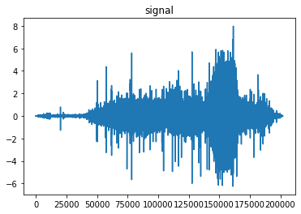
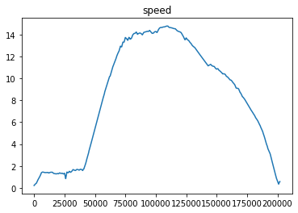
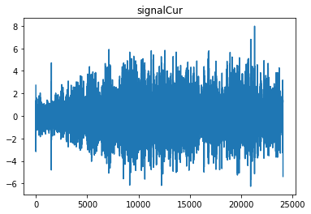
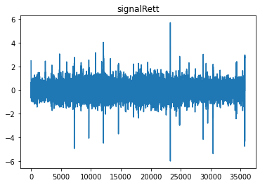
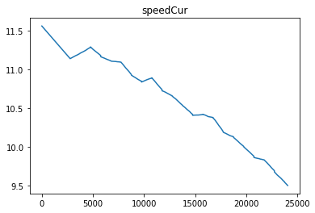
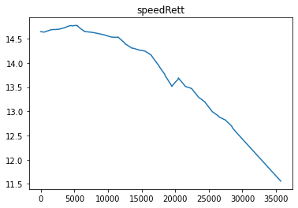

Note that in the signal relating to the straight section it is possible to appreciate effects due to characteristic elements of the railway section such as welds and joints.

Starting from this data, the goal is to use the Fourier transform to analyze frequencies and, through filtering techniques, reduce the curve component in the signal.

## Data Analysis
In order to study the relationship between the mean velocity and the frequencies representative of acceleration in the straight and curved sections, the mode, mean, median and variance of the frequencies are calculated.

To do this, the spectrograms of each of the integer signals are constructed and the frequencies are analyzed from these. For demonstration purposes, the spectrogram relating to the first signal of the dataset is reported:
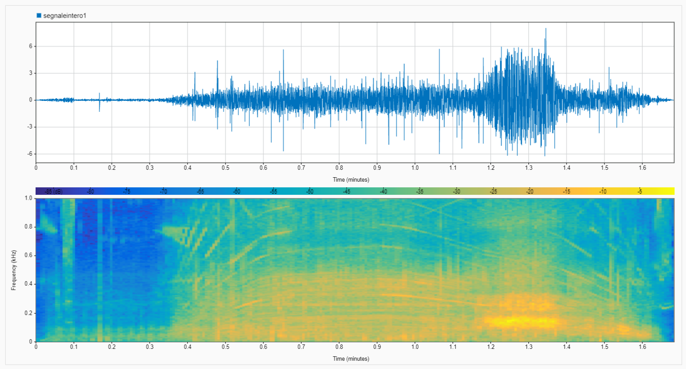

From the spectrogram, color bands of different intensities are observed, which vary according to the different excitation of the signal frequencies. In this case you can notice that the significant ones are concentrated around 150Hz.

At the bottom right, a marked intensity is observed due in part to the contribution of the curve; this phenomenon leads to greater excitation of the entire frequency band, particularly the band relating to the brightest area on the graph.

After obtaining the statistical data relating to each section, graphs are constructed to show the frequency mode:
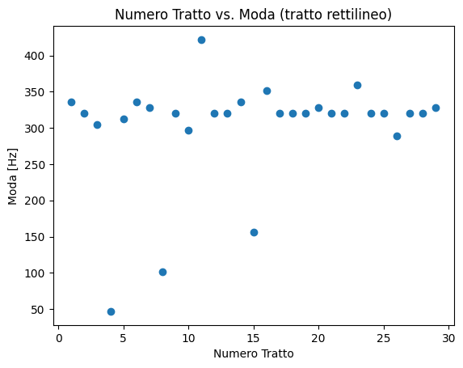
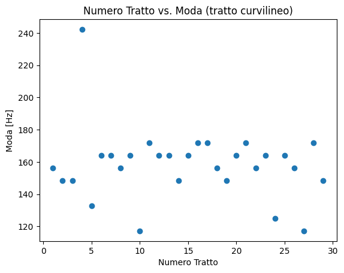
Subsequently, graphs of the frequency mode as a function of the average speed are constructed, for both the curvilinear and straight sections, to observe how the former behave as the latter vary.

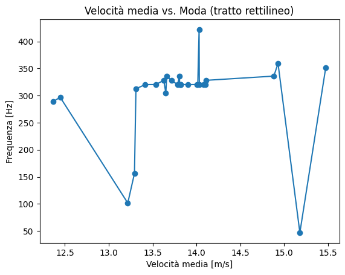
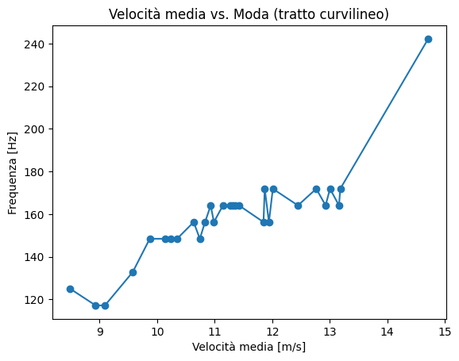

From what can be seen from the graphs, in the case of straight sections, there is no dependence on speed, in fact as this increases the mode remains unchanged as expected.

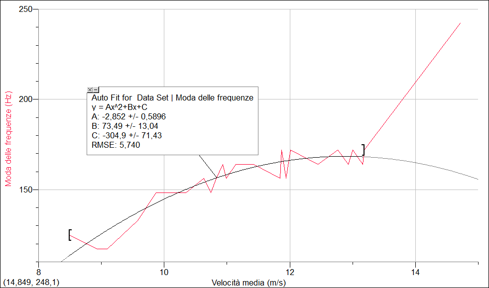

In contrast, in the case of curvilinear features, a quadratic dependence was found between the two variables. It is observed that the last of the points of the dataset present in the graph is considered as an outlier since it has an anomalous behavior compared to the others.

Looking at the mode of the frequencies representative of acceleration in the curvilinear sections, it can be noted that, for most signals, these are concentrated in the range between 140Hz and 160Hz. Therefore, signal filtering is done from this observation.

## Data Processing
The aim of signal filtering is mainly to eliminate "noise" due to the curve component, but in general there is more noise within the signal, for example related to the engine or to the railway components present on the tracks.

In order to filter the signals under consideration, two types of filters are constructed: Bandstop and Bandpass.

The Bandstop filter receives the range of frequencies under analysis as input and tries to make the signal as soft as possible;
The Bandpass filter, like the previous one, receives the frequency range as input and attenuates all frequencies outside of it.

Filters are applied to all signals relating to the 29 curved sections. The application range chosen for both filters is the one where the frequencies are concentrated, that is, with extremes of 140Hz and 160Hz.

For demonstration purposes, the graphs relating to the first section are reported:

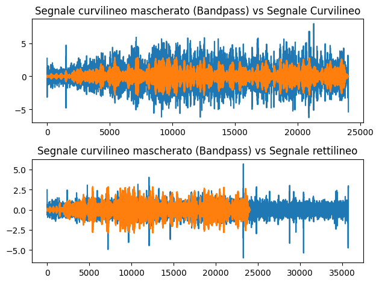
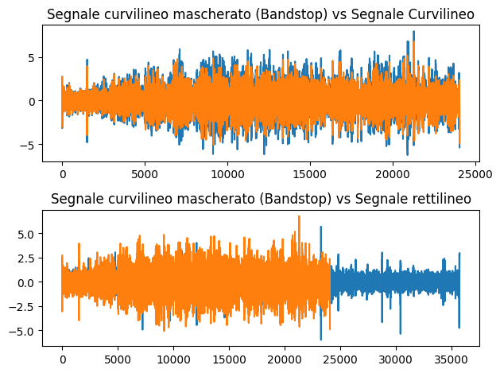

Note that: in the case of the Bandpass filter, the contribution of the curve is not optimally removed because frequency peaks that may be related to other events are excluded (such as the presence of welds or joints as the former are seen around 100Hz while the latter around 500Hz); in the case of the Bandstop filter, frequencies related to events outside those of the curve are preserved. Therefore, to remove the contribution of the curve while preserving the characteristics related to the passage of the train on the rail, Bandstop is the most effective. In detail:

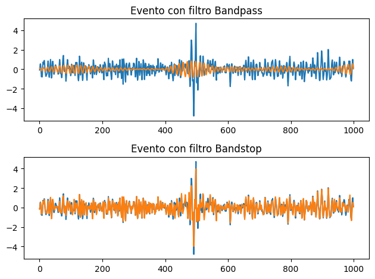

From the previous graph, you can see how the two filters behave differently near an event (possible joint): the Bandpass filter attenuates all frequencies, consequently also modifies those of significant phenomena, losing important information; the Bandstop filter, on the other hand, although it slightly dampens the amplitudes, keeps the event signature intact.

It should be noted, however, that the analysis performed is optimal for signals whose frequency mode is within the range between 140Hz and 160Hz, while for the others the procedure must be adapted. For example, if we consider the fourth of the 29 signals (the outlier), we can observe how the bandpass filter eliminates almost every frequency of the signal since its mode is much greater than 160Hz, so a different range should be chosen to apply the filter. In fact, if the range between 220Hz and 260Hz is considered, we get:

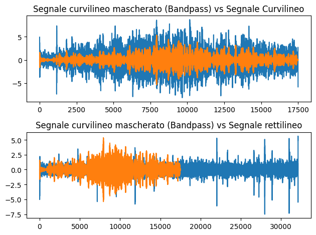

## Conclusions

In conclusion, to determine the optimal filter between these to reduce the curve contribution within the signal we introduce the RMS (Root Mean Square), a parameter that represents the average "power" of a signal. It turns out that the curve contribution is reduced if the RMS of the masked curvilinear signal approaches the RMS of the rectilinear signal. In the case in question, it appears:
- RMS curvilinear signal 1.4802765634496693
- RMS straight line signal 0.5271476514928798
- RMS curvilinear signal filtered with Bandpass 0.8402840635732278
- RMS curvilinear signal filtered with Bandstop 1.1613084176901567

Due to the nature of the signals, it is expected that as the distance between the extremes of the input range increases, the RMS will increase in the case of the Bandpass filter and decrease in the case of the Bandstop filter. In fact:

- RMS curvilinear signal 1.4802765634496693
- RMS straight line signal 0.5271476514928798
- RMS curvilinear signal filtered with Bandpass  1.2661536865258718
- RMS curvilinear signal filtered with Bandstop 0.7196270452702109

In conclusion, therefore, the Bandstop filter retains the characteristics of the events and has, for appropriate input intervals, an RMS close to that of the straight signal, therefore it is the most suitable for reducing the curve component. The signal from the first section filtered with Bandstop using the new interval is reported below:

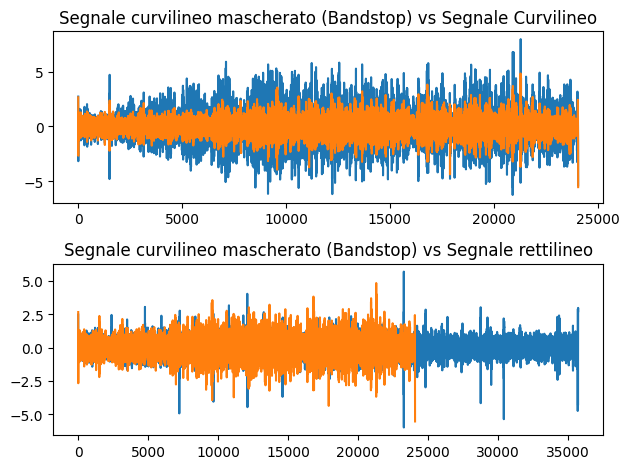

